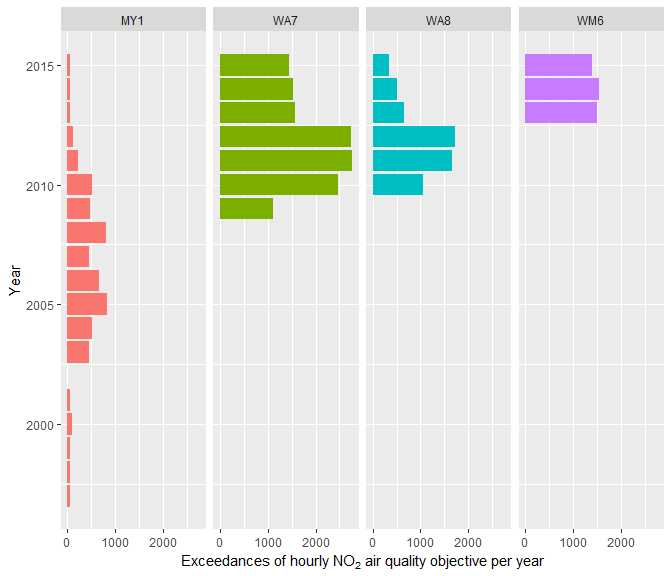
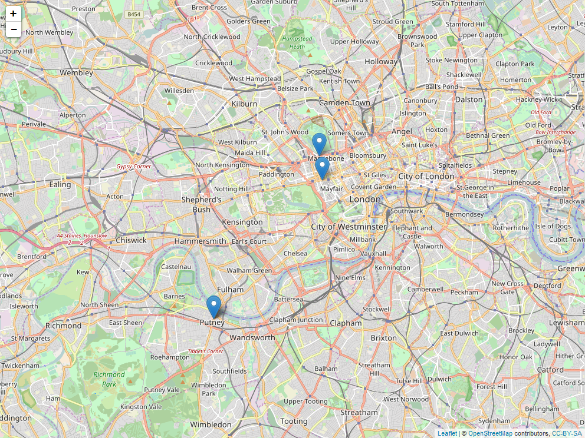

# ```rlaqn```: Data retrieval from the London Air API
Justin Lingard : [prejjnl@gmail.com](prejjnl@gmail.com)  
  


# Overview
```rlaqn``` allows retrieval of data from the [London Air API](http://www.londonair.org.uk/LondonAir/API/), the data feed of the [London Air Quality Network](http://www.londonair.org.uk/LondonAir/Default.aspx), operated by the Environemntal Research Group (ERG) at King's College London (KCL). The API provides a structured and convenient way to interact with the data from the LAQN.  Data is supplied in JSON format.

# Similar packages
+ [```openair```](http://www.openair-project.org/) which provides open-source tools for the analysis of air pollution data
+ [```ropenaq```](https://ropensci.org/tutorials/ropenaq_tutorial.html) which provides UK-AIR latest measured levels (see https://uk-air.defra.gov.uk/latest/currentlevels) as well as data from other countries
+ [```rdefra```](https://github.com/ropenscilabs/rdefra) which allows retrieval of air pollution data from the Defra's UK Air Information Resource ([UK-AIR](https://uk-air.defra.gov.uk/)).

# Dependencies
The ```rlaqn``` package depends some additional CRAN packages. Check for missing dependencies and install them using the commands below:

```r
> packs <- c('dplyr', 'ggplot2', 'jsonlite', 'leaflet', 'pander')
> new.packages <- packs[!(packs %in% installed.packages()[, 'Package'])]
> if(length(new.packages)) install.packages(new.packages)
```

# Installation
Install the development version from github using devtools:

```r
> devtools::install_github('JustinLingard/rlaqn')
```

Load the ```rlaqn``` package:

```r
> library('rlaqn')
```

# Functions
## ```get_laqn_aq_objectives```
```get_laqn_aq_objectives``` imports pre-calculated air quality objectives (statistics) for air pollutants for which national [air quality objectives](https://uk-air.defra.gov.uk/assets/documents/National_air_quality_objectives.pdf) exist, for each station in the LAQN, from the London Air API:

+ carbon monoxide, CO
+ nitrogen dioxide, NO<sub>2</sub>
+ ozone, O<sub>3</sub>
+ sulphur dioxide, SO<sub>2</sub>, and
+ particulate matter, PM<sub>10</sub>.

Statistics are calculated for each air quality monitoring station in the LAQN on a year-by-year basis. Statistics are available from the inception of the network in 1993, when it was composed of a few stations, to the much larger, current day network. The use of pre-calculated statistics removes the need to caluclate these metrics from raw, hourly data, and ensures good consistency with published data.

NOx (nitrogen oxides) and PM<sub>2.5</sub> statistics are not currently available, but if generated in future, should be picked-up by the function.

**Note:** *Ratification of the underlying air quality monitoring data, from which the statistics are calculated, is undertaken three to six months in arrears.  Subsequently, statistics for the current year can vary over time and should be viewed as provisional statistics (awaiting final ratification).*

Pre-calculated air quality statistics from the London Air API are comparable to those shown under the air quality objective values and capture rates on the Annual Air Quality Report for each air quality monitoring station in the LAQN, c.f., [Annual Air Quality Report for Westminster - Marylebone Road (01/01/2015 to 01/01/2016)](http://www.erg.kcl.ac.uk/weeklysitereport/asrstats.asp?site=MY1&startdate=1-Jan-2015).

Site meta data for past and current air quality monitoring station in the LAQN can be obtained using the ```get_laqn_sites``` function, as decsribed below.

```r
> get_laqn_aq_objectives <- function (theGroup = "London", metric = "Annual",
                                      data_type = "MonitoringObjective",
                                      dates = 1980, datee = as.numeric(format(Sys.Date(), "%Y")),
                                      api_type = "Json")
```
Running:

```r
> aq_objectives <- get_laqn_aq_objectives()
```
returns all the air quality objectives since the inception of the network, even when the start year (```dates```) is set to 1980 (before the network came into existence).  No data is retured for years where there is no data available and the function will just return an error message before moving onto the next year.

```r
> head(aq_objectives)
  SiteCode                          SiteName         SiteType  Latitude Longitude LatitudeWGS84
1      BG1 Barking and Dagenham - Rush Green         Suburban 51.563752  0.177891 6721627.34498
2      BG1 Barking and Dagenham - Rush Green         Suburban 51.563752  0.177891 6721627.34498
3      BL0               Camden - Bloomsbury Urban Background 51.522287 -0.125848 6714205.47041
4      BL0               Camden - Bloomsbury Urban Background 51.522287 -0.125848 6714205.47041
5      BL0               Camden - Bloomsbury Urban Background 51.522287 -0.125848 6714205.47041
6      BL0               Camden - Bloomsbury Urban Background 51.522287 -0.125848 6714205.47041
  LongitudeWGS84                                                        SiteLink
1  19802.7355367 http://www.londonair.org.uk/london/asp/publicstats.asp?site=BG1
2  19802.7355367 http://www.londonair.org.uk/london/asp/publicstats.asp?site=BG1
3 -14009.3352774 http://www.londonair.org.uk/london/asp/publicstats.asp?site=BL0
4 -14009.3352774 http://www.londonair.org.uk/london/asp/publicstats.asp?site=BL0
5 -14009.3352774 http://www.londonair.org.uk/london/asp/publicstats.asp?site=BL0
6 -14009.3352774 http://www.londonair.org.uk/london/asp/publicstats.asp?site=BL0
                                          DataOwner           DataManager SpeciesCode SpeciesDescription
1                              Barking and Dagenham King's College London         NO2   Nitrogen Dioxide
2                              Barking and Dagenham King's College London         SO2    Sulphur Dioxide
3 Department for Environment Food and Rural Affairs King's College London          CO    Carbon Monoxide
4 Department for Environment Food and Rural Affairs King's College London         NO2   Nitrogen Dioxide
5 Department for Environment Food and Rural Affairs King's College London         NO2   Nitrogen Dioxide
6 Department for Environment Food and Rural Affairs King's College London         NO2   Nitrogen Dioxide
  Year                                                            ObjectiveName Value Achieved
1 1993                                                         Capture Rate (%)    31      YES
2 1993                                                         Capture Rate (%)    30      YES
3 1993                                                         Capture Rate (%)    82      YES
4 1993 200 ug/m3 as a 1 hour mean, not to be exceeded more than 18 times a year     5      YES
5 1993                                               40 ug/m3 as an annual mean    65       NO
6 1993                                                         Capture Rate (%)    93      YES
```
## ```get_laqn_sites```
Site meta data, for each past and current air quality monitoring station in the LAQN, can be obtained using the ```get_laqn_sites``` function, e.g.,

```r
> laqn_sites <- get_laqn_sites()
> head(laqn_sites)
  LocalAuthorityCode   LocalAuthorityName SiteCode                              SiteName
1                  1 Barking and Dagenham      BG3   Barking and Dagenham - North Street
2                  1 Barking and Dagenham      BG1     Barking and Dagenham - Rush Green
3                  1 Barking and Dagenham      BG2 Barking and Dagenham - Scrattons Farm
4                  2               Barnet      BN2                     Barnet - Finchley
5                  2               Barnet      BN3             Barnet - Strawberry Vale 
6                  2               Barnet      BN1              Barnet - Tally Ho Corner
          SiteType          DateClosed          DateOpened         Latitude          Longitude
1         Kerbside 2011-05-25 00:00:00 2007-03-16 00:00:00        51.540444           0.074418
2         Suburban                     1999-11-02 00:00:00        51.563752           0.177891
3         Suburban                     1999-10-17 00:00:00        51.529389           0.132857
4 Urban Background 2012-04-20 00:00:00 2000-08-09 13:00:00        51.591901          -0.205992
5 Urban Background 2002-05-15 00:00:00 2000-08-14 14:00:00 51.6008848453589 -0.172297542087178
6         Kerbside 2012-04-20 00:00:00 1998-12-20 12:00:00        51.614675          -0.176607
  LatitudeWGS84 LongitudeWGS84            DataOwner           DataManager
1  6717454.5833  8284.17386585 Barking and Dagenham King's College London
2 6721627.34498  19802.7355367 Barking and Dagenham King's College London
3 6715476.18683  14789.5735883 Barking and Dagenham King's College London
4 6726669.62886 -22930.9245475               Barnet King's College London
5 6728279.54795 -19180.0746501               Barnet King's College London
6 6730751.38494 -19659.8013105               Barnet King's College London
                                                           SiteLink
1 http://www.londonair.org.uk/london/asp/publicdetails.asp?site=BG3
2 http://www.londonair.org.uk/london/asp/publicdetails.asp?site=BG1
3 http://www.londonair.org.uk/london/asp/publicdetails.asp?site=BG2
4 http://www.londonair.org.uk/london/asp/publicdetails.asp?site=BN2
5 http://www.londonair.org.uk/london/asp/publicdetails.asp?site=BN3
6 http://www.londonair.org.uk/london/asp/publicdetails.asp?site=BN1
```
Comparison of the output from ```get_laqn_sites``` with ```importMeta(source = "kcl", all = TRUE)``` from the ```openair``` package reveals some differences. ```importMeta``` returns the meta data for *all* air quality monitoring sites operated by KCL, including those outside London, e.g., those in the [UK Black Carbon network](https://uk-air.defra.gov.uk/networks/network-info?view=ukbsn), and other local authority networks.

```r
> kcl_sites <- openair::importMeta(source = "kcl", all = TRUE)
> head(kcl_sites)
  code                            site                                           Address la_id
1  ST1      Sutton - Robin Hood School Robin Hood Junior School, Thorncroft Road, Sutton    29
2  RY1            Rother - Rye Harbour                                       Rye Harbour   211
3  SB1          South Beds - Dunstable                             Dunstable, South Beds   150
4  EL1   Elmbridge - Bell Farm Hersham                                Bell Farm, Hersham    44
5  EL2   Elmbridge - Esher High Street                                 Esher High Street    44
6  CT6 City of London - Walbrook Wharf              Upper Thames Street / Walbrook Wharf     7
       Authority        site.type os_grid_x os_grid_y latitude  longitude         OpeningDate
1         Sutton         Roadside    525680    164420 51.36574 -0.1955630 1995-04-26 08:00:00
2         Rother            Rural    594283    119082 50.93845  0.7639150 2002-01-11 13:30:00
3   Herts & Beds Urban Background    501906    221822 51.88567 -0.5207337 2000-10-02 07:00:00
4      Elmbridge Urban Background    511403    164915 51.37235 -0.4009194 2001-01-01 00:00:00
5      Elmbridge         Roadside    514024    164792 51.37072 -0.3633206 2005-09-20 01:00:00
6 City of London         Roadside    532527    180789 51.51050 -0.0916340 2007-04-01 01:00:00
          ClosingDate
1 2002-04-26 01:00:00
2                <NA>
3 2010-04-28 01:00:00
4 2009-04-06 01:00:00
5 2008-07-18 09:30:00
6                <NA>
```
## ```get_site_aq_objectives```
```get_site_aq_objectives``` imports pre-calculated air quality objectives (statistics) for each air quality monitoring station for which KCL are site operators, this includes the LAQN  as well as a number of smaller local authority newtorks (the precise networks are detailed below under ```get_all_Groups```).

```r
> kcl_sites <- openair::importMeta(source = "kcl", all = TRUE)
> kcl_sites_aq_objectives <- get_site_aq_objectives(theSite = kcl_sites$code)
```
If *all* years, sites and air quality objectives are chosen, this will take some time to run, depending on your computer specification and return a large data frame with over 20,000 rows.

```r
> dim(kcl_sites_aq_objectives)
[1] 26503    16
```
The structure of the data frame will be similar to that of ```laqn_sites_aq_objectives```.

## ```get_all_Groups```
```get_all_Groups``` returns the ```Groups``` and the respective ```GroupName``` for all the air quality monitoring networks within the London Air API.

```r
> theGroups <- get_all_Groups()
> head(theGroups)
       GroupName                            Description                   WebsiteURL
1            All                All current network LAs    http://www.erg.kcl.ac.uk/
2   AroundLondon    Selection of boroughs around London http://www.londonair.org.uk/
3  CambridgeCity                  Demo group for tender                             
4 Cambridgeshire                  Demo group for tender                             
5          Essex               All 14 councils in Essex  http://www.essexair.org.uk/
6      Hampshire Various local authorities in Hampshire  http://www.hantsair.org.uk/
```
The ```GroupName``` can be passed to ```get_laqn_sites``` to generate the site meta data for the sites in the groups identified by ```GroupName```.

```r
> kcl_sites <- get_laqn_sites(theGroup = theData$GroupName)
> head(kcl_sites)
  LocalAuthorityCode   LocalAuthorityName SiteCode                              SiteName
1                179          Southampton      SH0       A33 Redbridge Road, Southampton
2                201                 Adur      AD1                Adur - Shoreham-by-Sea
3                  1 Barking and Dagenham      BG3   Barking and Dagenham - North Street
4                  1 Barking and Dagenham      BG1     Barking and Dagenham - Rush Green
5                  1 Barking and Dagenham      BG2 Barking and Dagenham - Scrattons Farm
6                  2               Barnet      BN2                     Barnet - Finchley
          SiteType          DateClosed          DateOpened         Latitude         Longitude
1         Roadside                     2015-12-04 00:00:00 50.9205490280862 -1.46363686588104
2         Kerbside                     2009-01-01 00:00:00 50.8321487360948 -0.27749852601479
3         Kerbside 2011-05-25 00:00:00 2007-03-16 00:00:00        51.540444          0.074418
4         Suburban                     1999-11-02 00:00:00        51.563752          0.177891
5         Suburban                     1999-10-17 00:00:00        51.529389          0.132857
6 Urban Background 2012-04-20 00:00:00 2000-08-09 13:00:00        51.591901         -0.205992
  LatitudeWGS84 LongitudeWGS84            DataOwner           DataManager
1                                       Southampton King's College London
2  6591656.3126 -30890.9946119                 Adur King's College London
3  6717454.5833  8284.17386585 Barking and Dagenham King's College London
4 6721627.34498  19802.7355367 Barking and Dagenham King's College London
5 6715476.18683  14789.5735883 Barking and Dagenham King's College London
6 6726669.62886 -22930.9245475               Barnet King's College London
                                                           SiteLink
1 http://www.londonair.org.uk/london/asp/publicdetails.asp?site=SH0
2 http://www.londonair.org.uk/london/asp/publicdetails.asp?site=AD1
3 http://www.londonair.org.uk/london/asp/publicdetails.asp?site=BG3
4 http://www.londonair.org.uk/london/asp/publicdetails.asp?site=BG1
5 http://www.londonair.org.uk/london/asp/publicdetails.asp?site=BG2
6 http://www.londonair.org.uk/london/asp/publicdetails.asp?site=BN2
```
This provides a similar output to ```openair::importMeta(source = "kcl", all = TRUE)```. Grouping and summarising the the data using ```dplyr``` reveals that there are only 354 unique `SiteCodes` as some sites appear several times.

```r
> library(dplyr)
> kcl_sites %>% 
      group_by(SiteCode) %>%
      summarise(no_rows = length(SiteCode))
# A tibble: 354 × 2
   SiteCode no_rows
      <chr>   <int>
1       A30       4
2       AD1       4
3       AR1       4
4       AR2       4
5       BA1       2
6       BG1       4
7       BG2       4
8       BG3       4
9       BH0       4
10      BH1       4
# ... with 344 more rows
```
Whereas

```r
> kcl_sites <- openair::importMeta(source = "kcl", all = TRUE)
> names(kcl_sites)
 [1] "code"        "site"        "Address"     "la_id"       "Authority"   "site.type"   "os_grid_x"  
 [8] "os_grid_y"   "latitude"    "longitude"   "OpeningDate" "ClosingDate"
> kcl_sites %>% 
      group_by(code) %>%
      summarise(no_rows = length(code))
# A tibble: 896 × 2
     code no_rows
   <fctr>   <int>
1     A30       1
2     AB0       1
3     AD1       1
4     AG0       1
5     AH0       1
6     AM0       1
7     AM1       1
8     AN0       1
9     AR1       1
10    AR2       1
# ... with 886 more rows
```
Reveals 896 unique values.  Therefore ```openair::importMeta(source = "kcl", all = TRUE)``` provides a more detailed summary of KCL site meta data.

# Applications
## ```get_laqn_aq_objectives```
The national air quality objective for hourly NO<sub>2</sub> permits 18 exceedances per year (also termed the *99.8<sup>th</sup>
percentile*). [Defra's Local Air Quality Management Technical Guidance (TG16) document](http://laqm.defra.gov.uk/documents/LAQM-TG16-April-16-v1.pdf) defines the locations at which hourly air quality objectives apply as "... outdoor locations (as defined in Box 1.1 on p.1-8) where they might might reasonably expected to spend one hour or longer." For "Kerbside sites" this includes pavements of busy shopping streets.

Due to high vehicle numbers and congestion on London's roads, road transport NOx emissions are high, especially in the vicinity of heavily trafficked roads, leading to elevated roadside NO<sub>2</sub> concentrations. Consequently, this objective is exceeded at a number of roadside throughout the UK and in London. Some examples are given below.

The air quality monitoring station at Marylebone Road (Westminster - Marylebone Road Kerbside, MY1) is located next to the six lane A501. Frequent elevated hourly NO<sub>2</sub> concentrations occur due to the high vehicle flows along the road which is an important thoroughfare in central London, running east-west from the Euston Road at Regent's Park, to the A40 Westway at Paddington.

Oxford Street forms part of the A40 and runs east-west, connecting traffic from the direction of Marble Arch, in the west, with Tottenham Court Road and Charing Cross Road, to the east. It is Europe's busiest shopping street, with around half a million daily visitors, and many retailers have flagship stores situated along the street. Traffic along the street is predominantly composed of buses and taxis, though cars have some restricted access via road intersections running perpendicular to Oxford Street. The air quality monitoring station in Oxford Street (Westminster - Oxford Street Kerbside, WM6) is located around 400, Oxford Street, opposite the entrance to the Selfridges department store seen here in [Google streetview](https://www.google.co.uk/maps/@51.5140307,-0.1525801,3a,75y,238.35h,76.36t/data=!3m6!1e1!3m4!1sJJcNTldyEc62NFXLfXk6QA!2e0!7i13312!8i6656). As Google streetview shows the monitoring enclosure is situated between two sets of lights: A pedestrian crossing and the traffic light controlled junction of North Audley Street, Orchard Street and Oxford Street.  Traffic can be seen queuing at the lights.

```r
> # Load the plyr package
> library(dplyr)
> westminster_sites <- aq_objectives %>% filter(SiteCode == "MY1" | SiteCode == "WM6") %>% filter(ObjectiveName == "200 ug/m3 as a 1 hour mean, not to be exceeded more than 18 times a year")
```
Frequent elevated hourly NO<sub>2</sub> concentrations also occur on Putney High Street, the A209.  Two air quality monitroing stations are located here: The first is Wandsworth - Putney High Street (WA7), the second Wandsworth - Putney High Street Facade (WA8). Putney High Street links traffic passing over Putney Bridge, from the direction of central London, to the South Circular Road (A205) and Upper Richmond Road, two major arterial roads in south London. Putney High Street has been described as the **most** polluted street in south London.

```r
> putney_sites <- aq_objectives %>% filter(SiteCode == "WA7" | SiteCode == "WA8") %>% filter( ObjectiveName == "200 ug/m3 as a 1 hour mean, not to be exceeded more than 18 times a year")
```
Combining the two sets of data provides an intercomparison of the number of exceedances of the hourly NO<sub>2</sub> national air quality objective at the four air quality monitoring stations by year over the past twenty years. Data for 2016 and 2017 has been removed as it is provisional and subject to further change, at the current time.

```r
> theData <- plyr::rbind.fill(westminster_sites, putney_sites)
> theData <- theData %>% filter(Year < as.integer(format(Sys.Date(), "%Y"))-1)
> library(ggplot2)
> ggplot(theData, aes(Year, Value, fill = SiteCode)) + geom_bar(stat ="identity", position = "dodge") + scale_y_continuous(name = "Exceedances per year") +  theme(legend.position = "none") + facet_grid(~SiteCode) + coord_flip()
```


```r
# Table 1
> theData <- arrange(select(theData, SiteCode, SiteName, Year, SpeciesCode, Value, Achieved), SiteCode, Year)
> theData$SpeciesCode <- gsub(pattern = "NO2", replacement = "NO<sub>2</sub>", theData$SpeciesCode)
> ggplot(theData, aes(Year, Value, fill = SiteCode)) + geom_bar(stat ="identity", position = "dodge") + scale_y_continuous(name = bquote('Exceedances of hourly' ~NO[2]~ 'air quality objective per year')) +  theme(legend.position = "none") + facet_grid(~SiteCode) + coord_flip()
```

<!-- -->


**Note:** *There is no data for Putney High Street prior to 2009 whilst measurements at Putney High Street Facade commenced the following year.  NO<sub>2</sub> statistics for Oxford Street Kerbside are not available until 2013.*

The barplot shows that hourly NO<sub>2</sub> concentrations at all sites routinely exceed the national air quality objective of 18 exceedances per year.  Whilst the number have fallen at all sites in recent years, it still remains high.  The number of exceedances were especially high at Putney High Street and Putney High Street Facade where 1443 and 336 exceedances, respectively, were recorded in 2015.  The number at Marylebone Road and Oxford Street Kerbside were 56 and 1391, respectively, for the same year.

## ```get_laqn_sites```
The location of the LAQN air quality monitoring stations at Marylebone Road, Oxford Street and Putney High Street can be viewed by using the ouput from ```get_laqn_sites```.

**Note:** *The two sites in Putney appear coincident when plotted at* ```zoom = 12``` *, as given in the code below*.

```r
> #  Select theSites
> theSites <- laqn_sites %>% filter(SiteCode == "MY1" | SiteCode == "WM6" | SiteCode == "WA7" | SiteCode == "WA8")
> # Load the leaflet package
> library(leaflet)
> m <- leaflet() %>%
> setView(lng = -0.17, lat = 51.5, zoom = 12) %>%
  addTiles() %>%
  addMarkers(lng = theSites$Longitude,
             lat = theSites$Latitude,
             popup = paste(theSites$SiteName, theSites$SiteLink, sep = ", "))
> m  # Print the map
```



